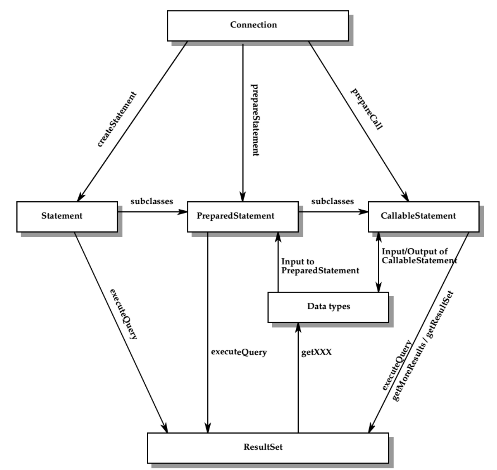
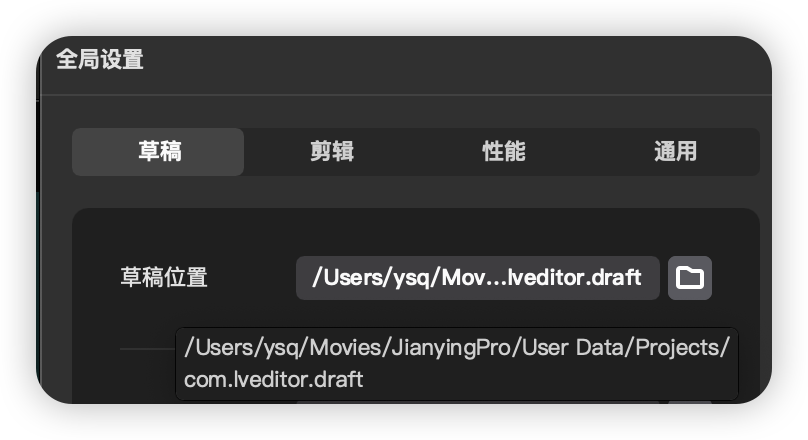
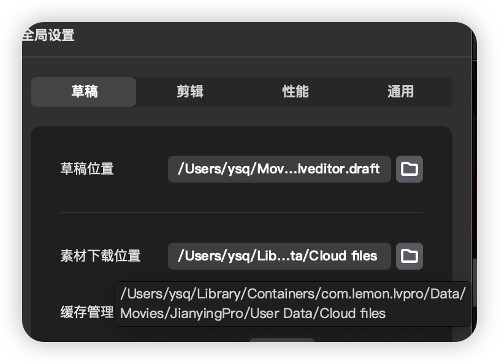
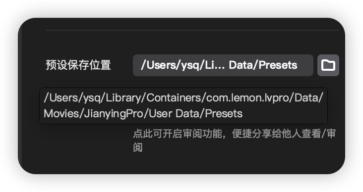

使用 JDBC 操作数据源大致需要以下几个步骤

> 1. 与数据源建立连接
>
>    ```java
>    Connection connection = DriverManger.getConnection("jdbc:mysql://localhost:3306/test","root","root");
>    ```
>
> 2. 执行 sql 语句
>
>    ```java
>    String sql = "select * from t_user where id = ?";
>    PreparedStatement pst = connection.prepareStatement(sql);
>    pst.setInt(1, 20);
>    pst.execute();
>    ```
>
> 3. 检索 sql 执行结果
>
>    ```java
>    ResultSet rs = pst.getResultSet();
>    while (rs.next()) {
>      System.out.println(rs.getLong("id"));
>    }
>    ```
>
> 4. 关闭连接
>
>    ```java
>    connection.close();
>    ```
>
>    


在 JDBC 中，Connection、Statement、ResultSet 之间的关系如下图：













https://github.com/a511480568/tomcat-9.0.x.git

https://github.com/a511480568/tomcat-9.0.x.git


```xml
<?xml version="1.0" encoding="UTF-8"?>
<project xmlns="http://maven.apache.org/POM/4.0.0"
         xmlns:xsi="http://www.w3.org/2001/XMLSchema-instance"
         xsi:schemaLocation="http://maven.apache.org/POM/4.0.0 http://maven.apache.org/xsd/maven-4.0.0.xsd">

  <modelVersion>4.0.0</modelVersion>
  <groupId>org.apache.tomcat</groupId>
  <artifactId>tomcat9.0.x</artifactId>
  <name>tomcat-9.0.x</name>
  <version>9.0.x</version>

  <properties>
    <maven.compiler.source>17</maven.compiler.source>
    <maven.compiler.target>17</maven.compiler.target>
    <project.build.sourceEncoding>UTF-8</project.build.sourceEncoding>
  </properties>

  <dependencies>
    <dependency>
      <groupId>junit</groupId>
      <artifactId>junit</artifactId>
      <version>4.13.2</version>
      <scope>test</scope>
    </dependency>

    <dependency>
      <groupId>org.easymock</groupId>
      <artifactId>easymock</artifactId>
      <version>4.3</version>
    </dependency>

    <dependency>
      <groupId>org.apache.ant</groupId>
      <artifactId>ant</artifactId>
      <version>1.9.5</version>
    </dependency>

    <dependency>
      <groupId>javax.xml.rpc</groupId>
      <artifactId>javax.xml.rpc-api</artifactId>
      <version>1.1</version>
    </dependency>

    <dependency>
      <groupId>wsdl4j</groupId>
      <artifactId>wsdl4j</artifactId>
      <version>1.6.2</version>
    </dependency>

    <!-- https://mvnrepository.com/artifact/org.eclipse.jdt/ecj -->
    <dependency>
      <groupId>org.eclipse.jdt</groupId>
      <artifactId>ecj</artifactId>
      <version>3.28.0</version>
    </dependency>

    <!-- https://mvnrepository.com/artifact/biz.aQute.bnd/biz.aQute.bndlib -->
    <dependency>
      <groupId>biz.aQute.bnd</groupId>
      <artifactId>biz.aQute.bndlib</artifactId>
      <version>6.4.0</version>
    </dependency>


  </dependencies>

  <build>
    <finalName>Tomcat9.0.x</finalName>
    <sourceDirectory>java</sourceDirectory>
    <resources>
      <resource>
        <directory>java</directory>
      </resource>
    </resources>

    <plugins>
      <plugin>
        <groupId>org.apache.maven.plugins</groupId>
        <artifactId>maven-compiler-plugin</artifactId>
        <version>3.11.0</version>
        <configuration>
          <encoding>UTF-8</encoding>
          <source>17</source>
          <target>17</target>
        </configuration>
      </plugin>

    </plugins>
  </build>
</project>

```


 ```mark
 -Dcatalina.home=/Volumes/mymac/project/java/tomcat-main/home
 -Dcatalina.base=/Volumes/mymac/project/java/tomcat-main/home
 -Djava.util.logging.manager=org.apache.juli.ClassLoaderLogManager
 -Djava.util.logging.config.file=/Volumes/mymac/project/java/tomcat-main/home/conf/logging.properties
 -Dfile.encoding=utf-8
 ```


